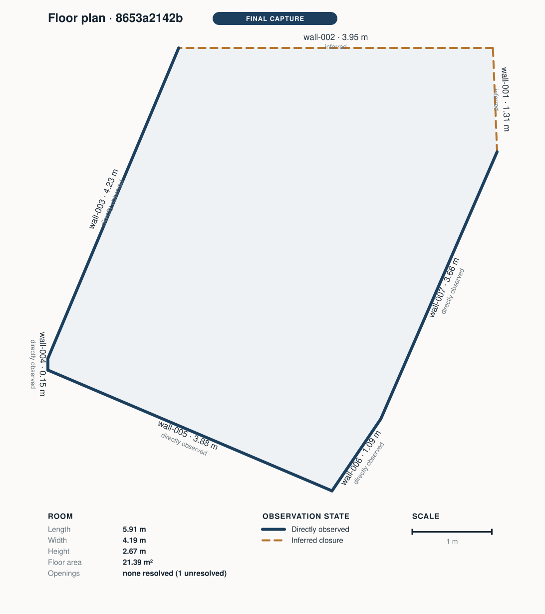
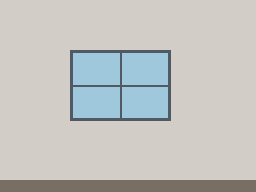
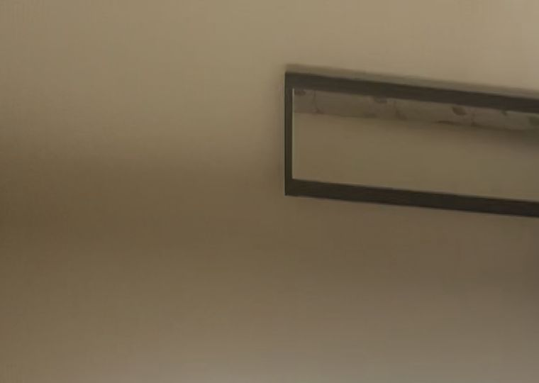
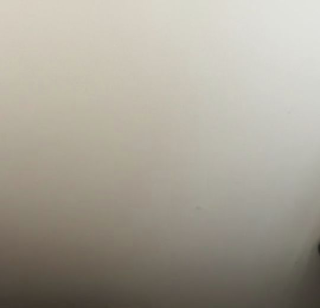

# Spatial AI

## Give AI a memory of the physical world.

Spatial AI turns mobile RGB-D and LiDAR captures into persistent physical spaces that AI can query, inspect, and reason over.

Scan a room once and get:

- **persistent walls, floors, ceilings, and openings**
- **metric dimensions and floor area**
- **registered visual evidence for each surface**
- **2D and 3D spatial representations**
- **AI reasoning grounded to physical entities**

Instead of treating every image as an isolated frame, Spatial AI gives observations a stable physical identity like `wall-002`.

That means AI can reason about the same surface across multiple views, measurements, and future captures.

---

## Why Spatial AI?

Vision models understand images.

They do not naturally know:

- that the wall in image A is the same wall in image B
- where that wall exists in 3D
- how large it is
- which observations belong to it
- what changed on it later

Spatial AI adds that missing physical context.

---

## Spatial Identity in Action (`wall-002`)

> **One physical entity · 2D Plan · 3D Mesh · Registered Evidence · AI Reasoning · One persistent identity**

```text
  2D Metric Plan            3D Spatial Model          Registered Evidence         Grounded AI Finding
 wall-002 (3.95 m)   ──▶   wall-002 Mesh Highlight   ──▶   Camera View Pose   ──▶   Entity: wall-002
 Metric Bounds             Persistent Wireframe            evidence_wall_01.jpg      Clean Grounding Contour
```

| 1. Select Entity (2D Plan) | 2. Persistent 3D Mesh | 3. Registered RGB Evidence | 4. Grounded AI Reasoning |
| :---: | :---: | :---: | :---: |
|  |  |  |  |
| **`wall-002`** selected on 2D floorplan (`3.95 m`). | **`wall-002`** highlighted in 3D wireframe reconstruction. | RGB stills registered to **`wall-002`** by camera pose. | AI interprets visual evidence bound to **`wall-002`**. |

---

## Architecture Flow

```text
Phone capture (ARKitScenes / Stray Scanner)
    ↓
Source-neutral normalization & deterministic 3D geometry
    ↓
Persistent spatial model (wall-001 · wall-002 · floor-001)
    ↓
Registered visual evidence stills
    ↓
AI reasoning over physical entities
```

---

## Try it

### 1. Install & Run Local Service

```bash
git clone https://github.com/SaiTejaMutchi/spatial-ai.git
cd spatial-ai
pip install -r pipeline/requirements.txt
./run_local.sh
```

Open `http://127.0.0.1:8420` in your browser.

### 2. Experience the Workflow

```text
Open a saved space
→ select wall-002
→ inspect dimensions
→ inspect registered evidence
→ inspect AI findings
```

---

## Python SDK (`spatial_ai`)

Use Spatial AI directly as a developer primitive:

```python
from spatial_ai import Space

# Load a processed spatial capture
space = Space.load("samples/public_results/public-stray-8653a2142b/output")

# Inspect room metrics & physical surfaces
print(space.dimensions)
# {'length_m': 5.42, 'width_m': 3.78, 'height_m': 2.43, 'area_sq_m': 20.47}

for surface in space.surfaces:
    print(f"{surface.surface_id}: {surface.type} ({surface.measurements.get('width_m')}m x {surface.measurements.get('height_m')}m)")

# Query a specific surface & its registered visual evidence
wall = space.surface("wall-002")
print("Registered evidence stills:", len(wall.evidence))

# Ask AI questions grounded in physical space
assessment = space.ask("Which wall contains the window or opening?")
print(assessment.answer)
print(assessment.entity_ids)
```

---

## Core Developer Primitives

- **Source-Neutral Ingestion**: Connectors for ARKitScenes, Stray Scanner, and custom RGB-D formats map into a unified `NormalizedCapture` contract.
- **Deterministic 3D Geometry**: Gravity-aligned plane extraction, Hough wall fitting, and minimum-area enclosing rectangles deliver yaw-invariant metric dimensions.
- **Canonical System of Record**: A single `spatial_model.json` document guarantees absolute consistency across 2D SVG plans, 3D OBJ models, and AI assessments.
- **Immutable Metric Boundaries**: AI models are restricted to semantic interpretation and visual grounding — they cannot mutate metric geometry or dimensions.

---

## Evaluation, Methodology & Technical Appendix

<details>
<summary><b>Click to expand Evaluation, Benchmarks & Technical Appendix</b></summary>

### Assessment Status & Limitations

The current snapshot is `DEV_COMPLETE` on public development data. It is **not proven** on a real iPhone capture, and **no accuracy claim** is made.

| Capability | Current Status |
| :--- | :--- |
| Source-Neutral Connector Contract | **Proven** on ARKitScenes & Stray Scanner |
| Geometry & Model Coherence | **Proven** (2D plan, 3D model, and canonical JSON are mutually consistent) |
| Local PWA & API Service | **Proven** (Browser $\rightarrow$ API $\rightarrow$ Pipeline $\rightarrow$ Rendered outputs) |
| Independent Laser Benchmark | **Evaluated** (FARO reference benchmark height delta: 2.46 cm against 1.5 cm gate) |
| Measurement Accuracy on Real Homes | **In Progress** (Deferred to full self-captured tape benchmark suite) |

### Independent Reference Benchmark

Against FARO laser scanner reference data on ARKitScenes sample `47333462`:
- **Room Height**: Reconstructed height 2.427 m vs FARO reference 2.402 m (room height misses the 1.5 cm gate by 2.46 cm).
- **Details**: See [`output/development_reference_benchmark.md`](output/development_reference_benchmark.md) for full error arithmetic.

### Reproducibility & Configuration Freeze

Consequential geometry parameters are frozen and hashed:
- **Geometry Config Hash**: `fb7900299311d51c610aecf9f42ffa1332297fe533ba11c05ed8c34ee959e0b0`
- **Freeze Manifest**: [`output/config_freeze_manifest.json`](output/config_freeze_manifest.json)
- **Freeze Command**: `python3 -m pipeline.freeze --freeze`

### Tests & Verification

Run the automated test suite:

```bash
python3 -m pytest pipeline/tests/ -q
```

</details>

---

## License

MIT License. See [LICENSE](LICENSE) for details.
